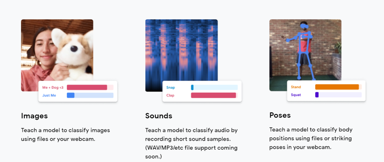
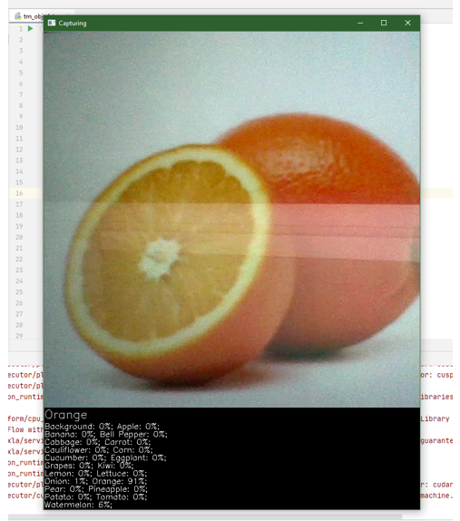

# Techable-Machine-Turkish-Directory
Google Techable Machine Kullanımı Hakkında Rehber ve Meyve-Sebze Sınıflandırma Projesi

<h2> Bilgilendirme </h2>

Bu projede <a href="https://www.kaggle.com/kritikseth/fruit-and-vegetable-image-recognition/">Kaggle</a> üzerinden meyve ve sebzeleri içeren bu veri seti kullanılmıştır. Orijinal GitHub dosyaları <a href="https://github.com/mjdargen/Teachable-Machine-Object-Detection/">Michael D'Argenio</a> ait olup kaynak kodları yardımıyla farklı bir görüntü işleme projesi olarak düzenlenmiştir.

<h2> Öğretilebilir Makine (Teachable Machine) Nedir?</h2>

İlk versiyonu 2017 yılında yayınlanmış olan ve en kısa tanımı ile makine öğrenimi modelleri oluşturmayı hızlı, kolay ve herkes için erişilebilir olan web tabanlı bir araçtır denebilir. Öğretilebilir makine, web tarayıcımızda yaptığımız modelleri eğitmek ve çalıştırmak için Javascript’te makine öğrenmesi için kullanılan TensorFlow.js kitaplığını kullanmaktadır. Tek bir cümle ile ifade etmek istersek herhangi bir kodlamada yapmadan kendi derin öğrenme modelimizi geliştirmeye imkan sağlar. Bu aracı kullanımı ise oldukça basit :

 <ol>
    <li>Örneklerimizi, modelimizin öğrenmesini istediğimiz sınıf veya kategoriler halinde gruplarız.</li>
    <li>Modelimizi tek bir buton ile eğitip, ardından yeni örnekleri doğru şekilde sınıflandırılıp sınıflandırılmadığını test ederiz.</li>
    <li>Modelimizi siteler, uygulamalar gibi birçok alan için ücretsiz bir şekilde indirebiliriz.</li>
  </ol>

 Öğretilebilir makine esnek bir yapıya sahiptir. Bu esnek yapı sayesinde halihazırda olan dosyalarımızı kullanabilir veya o an web kamerası veya mikrofonu kullanarak verilerimizi oluşturabiliriz.
  

 Şuanlık sadece üç model sunmaktadır. Fotoğraf, ses veya poz sınıflandırabiliyoruz. Geliştiriciler yakın zamanda yeni modellerin geleceğini de belirtmektedir.
  

 Öğretebilir makine ile yapılan tüm modeller, Javascript’in çalıştığı her yerde çalışabilen TensorFlow.js modelleridir. Bu nedenle Glitch, P5,js, Node.js gibi araçlar ile verimli çalışabilmektedir.
  

<h2> Adım Adım Teachable Machine Kullanımı</h2>

<h3>Adım 1: Teachable Machine Üzerinden Model Oluşturma</h3>

<strong>Projenin Se&ccedil;ilmesi:</strong> Teachable Machine olduk&ccedil;a kolay bir aray&uuml;ze sahiptir. Bu proje de g&ouml;r&uuml;nt&uuml; işleme &uuml;zerine bir model geliştirip yerel bilgisayarımızda &ccedil;alıştırmayı hedefliyoruz. <a href="https://teachablemachine.withgoogle.com/">https://teachablemachine.withgoogle.com/</a> adresine gidin ve &lsquo;Get Started&rsquo; kısmına tıklayınız. Sonrasında &lsquo;Image Project&rsquo; ksımını se&ccedil;erek devam edin. Bu se&ccedil;im bize resimlerden model oluşturup eğitebileceğimiz bir sayfa a&ccedil;ar.

<strong>Veri Setinin Oluşturulması: </strong>Resimleri sınıflandırmak ve modeli eğitmek i&ccedil;in sınıfları ekleyip onlara etiket atamalısınız. Bu etiketleri yani sınıf adlarını model eğitildikten sonra nesneyi tanıdığında ne olduğunu belirtmek i&ccedil;in kullanacak.

Bir grubu &lsquo;Arka Plan&rsquo; sınıfı olarak atmak mantıklı olacaktır. B&ouml;ylelikle herhangi bir nesne konulmadığında arka plan &ccedil;ıktısı alırız. Buna ek olarak arka plandaki ayrıntıları diğer etiketli sınıflardan biriyle ilişkilendirilmemesine yardımcı oluruz.

Bir sınıfa g&ouml;r&uuml;nt&uuml; eklemek i&ccedil;in, webcam kullanabileceğiniz gibi başka kaynaktan g&ouml;r&uuml;nt&uuml;ler y&uuml;kleyebiliriz. İnternet &uuml;zerinden hazır veri setleri bulacağımız gibi kendi veri setlerimizi de oluşturabiliriz. Bu &ouml;rnekte Kaggle&rsquo;da bulunan ve bu link (<a href="https://www.kaggle.com/kritikseth/fruit-and-vegetable-image-recognition">https://www.kaggle.com/kritikseth/fruit-and-vegetable-image-recognition</a>) &uuml;zerinden erişilebilir olan meyve ve sebzeler &uuml;zerine fotoğraflardan oluşan seti kullanıyoruz.

<strong>Modeli Eğitmek: </strong>T&uuml;m sınıfları oluşturduktan ve veri setimizin yeteri kadar fotoğraf i&ccedil;erdiğinden emin olduktan sonra modeli eğitme aşamasına gelmiş oluyoruz. Modeli eğitmek i&ccedil;in tarayıcı &uuml;zerindeki sekmeyi a&ccedil;ık bırakmalısınız ve elbette modeli eğitmek biraz zaman alabilmektedir. Tamamlandıktan sonra modeli test etme kısmına gelmiş oluyoruz.

<strong>Modeli Test Etmek: </strong>Şimdi eğitilmiş modelimizi test etme ve başarısının nasıl olduğunu g&ouml;rebiliriz. &Ouml;nizleme b&ouml;lgesine gidip &lsquo;Input&rsquo; se&ccedil;eneğini a&ccedil;arsak web kameramız a&ccedil;ılacaktır. Web kamerası &ouml;n&uuml;ne eğitirken kullandığınız nesneleri koyarak doğru tahmin edip etmediğini kontrol edebiliriz. Eğer iyi bir performans almadığınızı d&uuml;ş&uuml;n&uuml;yorsanız modeli dağa &ccedil;ok fotoğraf ile besleyerek tekrar eğitmeyi deneyin, memnunsanız modeli dışa aktarma zamanı gelmiştir.

<strong>Modeli Dışarı Aktarma: </strong>Modeli dışarı aktarmak i&ccedil;in &lsquo;Export Model&rsquo; butonuna tıklayın. Yeni bir pencere a&ccedil;ılacaktır. &lsquo;Tensorflow&rsquo; sekmesine tıkladıktan sonra hemen sonrasında &lsquo;Keras&rsquo; t&uuml;r&uuml;n&uuml; se&ccedil;iniz. Bu işlemden sonra &lsquo;Download my model&rsquo; diyerek modelinizi indirin. Modei sıkıştırmak ve indirmeye hazır hale getirmek birka&ccedil; dakika s&uuml;rebilir. Bir &lsquo;.zip&rsquo; doyası inecektir. Zip i&ccedil;erisindeki dosyaları dışarı &ccedil;ıkarttığınızda &lsquo;keras_model.h5&rsquo; dosyası ve bir &lsquo;label.txt&rsquo; dosyası g&ouml;rmelisiniz. Bu dosyları konumunu unutmayacağınız bir yere taşımanızı tavsiye ederim.

<h3>Adım 2: Python 3 Kurulumu</h3>

Yapılması gereken ilk işlem eğer bilgisayarınızda halihazırda kurulu değilse Python 3&rsquo;&uuml; kurmak olacaktır. <a href="https://www.python.org/downloads/">https://www.python.org/downloads/</a> adresine gidip işletim sisteminiz i&ccedil;in doğru kurulumu indirip &ccedil;alıştırabilirsiniz. Kurulum sırasında, Python&rsquo;u Path&rsquo;e eklmek i&ccedil;in kutuyu işaretlediğinizden emin olun.

Python&rsquo;u tam olarak y&uuml;kledikten ve Path&rsquo;e ekledikten sonra, terminalizden veta komut istemcisini a&ccedil;ıp &lsquo;python &ndash;version&rsquo; ve hemen ardından &lsquo;python3 &ndash;version&rsquo; yazın. Bu &ouml;nemlidir &ccedil;&uuml;nk&uuml;; &lsquo;python&rsquo; veya &lsquo;python3&rsquo; komutunun Python 3 kurulumunuzla eşleşip eşleşmediğini bilmek istiyoruz. Python komut satırlarını &ccedil;alıştırmak ve teni Python paketleri y&uuml;klemek gibi işlemler i&ccedil;in bilmemiz gerek. Python ve Python3 ile hi&ccedil;bir y&uuml;r&uuml;t&uuml;lebilir dosya eşlenmemiş ise, işletim sisteminizin Path kısmına ortam değişkenleri eklemeyi deneyebilirsiniz.

Şimdi bu projeyi yaparken yararlandığımız dosyaları, makine &ouml;ğrenimi modelini ve demo Python programını projeyi farklı bir veri seti ile yapan Micheal&rsquo;in Github deposundan veya direkt olarak bu projeyi şahsi Github depomdan almanız gerekecek. Bir git istemcisi kurabilir ve depoyu klonlayabilir veya isterseniz direkt tarayıcınızdan deponun zip dosyasını indirebilirsiniz:

Micheal Github Depo Linki : <a href="https://github.com/mjdargen/Teachable-Machine-Object-Detection">https://github.com/mjdargen/Teachable-Machine-Object-Detection</a>

<h3>Adım 3: Python Ortamını Ayarlama: OpenCV ve TensorFlow</h3>

Bu geliştirme ortamı i&ccedil;in kurulum s&uuml;recini basitleştirmek adına Micheal&rsquo;in hazırladığı kurulum komut dosyalarını kullanacağız. Github &uuml;zerinden aldığım dosyalar i&ccedil;erisinde &lsquo;installation_scripts&rsquo; adlı klas&ouml;r&uuml;n i&ccedil;erisine girmeliyiz. İşletim sistemimize uygun olan &ccedil;alıştırmalıyız.

<strong>Windows Kurulumu : </strong>Python 3&rsquo;&uuml;n kurulu olduğunu varsayar.Python 3 &ccedil;alıştırılabilir dosyanızın &lsquo;python3&rsquo; ile &ccedil;ağrıldığını varsayar. Aksi takdirde, kabuk komut dosyasını d&uuml;zenlemeniz ve &lsquo;python3&rsquo; komutunun her &ouml;rneğini &lsquo;python&rsquo; ile değiştirmeniz gerekir. &lsquo;Windows_install.btt&rsquo; toplu komut dosyasını &ccedil;alıştırmalıyız ancak y&ouml;netici olarak <strong>&ccedil;alıştırmayalım. </strong>Sistem ve internet hızına bağlı olarak yarım saat veya daha fazla s&uuml;rebilmektedir.

<strong>Mac Kurulumu: </strong>Python 3&rsquo;&uuml;n kurulu olduğunu varsayar.Python 3 &ccedil;alıştırılabilir dosyanızın &lsquo;python3&rsquo; ile &ccedil;ağrıldığını varsayar. Aksi takdirde, kabuk komut dosyasını d&uuml;zenlemeniz ve &lsquo;python3&rsquo; komutunun her &ouml;rneğini &lsquo;python&rsquo; ile değiştirmeniz gerekir. İndirilen dosyların olduğu klas&ouml;rde a&ccedil;ılan terminale şu kodu yazarak komut dosyasını &ccedil;alıştırılabilir hale getirmeniz gerekmektedir :

<ul>
<li>sudo chmod + x ./installation_scripts/mac_install.sh&nbsp;</li>
</ul>

&nbsp;Kabuk komut dosyasını şu komutu kullanarak &ccedil;alıştırabilirsiniz:

<ul>
<li>./installation_scripts/mac_install.sh</li>
</ul>

&nbsp;Sistem ve internet hızına bağlı olarak yarım saat veya daha fazla s&uuml;rebilmektedir.

<strong>Linux Kurulumu: </strong>Python 3&rsquo;&uuml;n kurulu olduğunu varsayar.Python 3 &ccedil;alıştırılabilir dosyanızın &lsquo;python3&rsquo; ile &ccedil;ağrıldığını varsayar. Aksi takdirde, kabuk komut dosyasını d&uuml;zenlemeniz ve &lsquo;python3&rsquo; komutunun her &ouml;rneğini &lsquo;python&rsquo; ile değiştirmeniz gerekir. İndirilen dosyların olduğu klas&ouml;rde a&ccedil;ılan terminale şu kodu yazarak komut dosyasını &ccedil;alıştırılabilir hale getirmeniz gerekmektedir :

<ul>
<li> sudo chmod + x ./installation_scripts/linux_install.sh</li>
</ul>

&nbsp;&nbsp;Kabuk komut dosyasını şu komutu kullanarak &ccedil;alıştırabilirsiniz:

<ul>
<li>./installation_scripts/inux_install.sh</li>
</ul>

&nbsp;<strong>Not: OpenCV ve Tensorfow kurulumlarını resmi siteleri &uuml;zerinden de yapabilirsiniz.</strong>

<h3>Adım 4: Kaynak Kodunu Ayarlama</h3>

Artık OpenCV ve TensorFlow geliştirme ortamı kurulumlarına sahip olduğumuza g&ouml;re Teachable Machine modelimizi &ccedil;alıştırabiliriz. Sağlanılan &ouml;rnek modeli veta oluşturup dışa aktardığınız modeli kullanabilirisiniz

Modelimizi dışarı aktardırdıktan ve sonrada &lsquo;.zip&rsquo; dosyasından dizine &ccedil;ıkardıktan sonra &lsquo;.h5&rsquo; uzantılı dosyamız ve &lsquo;label.txt&rsquo; dosyamız vardı. Bunları kopyalıp Github &uuml;zerinden indirdiğimiz dosyların dizininde bulunan &lsquo;la_croix_model&rsquo; klas&ouml;r&uuml;n&uuml;n i&ccedil;ine yapıştırıp i&ccedil;eride aynı adla bulunan dosyalarla değiştir dememiz yeterlidir.

Webcam video beslemesinin genişlik ve y&uuml;kselliğini piksel cinsenden belirlemek i&ccedil;in &lsquo;tm_obj_det.py&rsquo; dosyasını sağ tık yaptıktan sonra &lsquo;Edit with IDLE&rsquo; diyebiliriz (Windows bilgisayarlar i&ccedil;in). A&ccedil;tıktan sonra &lsquo;frameWidth&rsquo; ve &lsquo;frameHeight&rsquo; değişkenlerini g&uuml;ncelleyebilirsiniz veya bu kısma hi&ccedil; dokunmadan devam edebilirsiniz.

İsterseniz g&uuml;ven eşiğini (conf_threshold)&nbsp; ayarlayabilirsiniz. Bu değişken, modelimizin g&ouml;r&uuml;nt&uuml;y&uuml; etiketlemeden ve tahmini s&ouml;ylemeden mnce ne kadar emin olmasını belirlediğimiz bir y&uuml;zde değeridir. Varsayılan olarak g&uuml;ven eşiği %90&rsquo;a ayarlanmıştır.

Son olarak, videonun d&uuml;zg&uuml;n bir şekilde g&ouml;sterilmesi ile ilgili sorunla karşılaşıyorsanız, matplotlib uygulamasını kullanabilirsiniz. Bunun i&ccedil;in &lsquo;cv.imshow&rsquo; ve &lsquo;cv2.waitKey&rsquo; satırlarını yorumlamanız gerekecektir. Daha sonrasında &lsquo;import matplotlib&rsquo; ve kodun sonlarına doğru olan olan &lsquo;plt&rsquo; kod satırlarının yorumlarını kaldırmanız gerekecektir.

<h3>Adım 5: Çalıştırma Zamanı</h3>

Artık kodumuz &ccedil;alışacak şekilde ayarlanmış olmalı. Dizine gidin, terminal yardımıyla veya kullandığınız bir IDE (T&uuml;mleşik Geliştirme Ortamı) aracılığıyla &lsquo;tm_obj_det.py&rsquo; dosyasını &ccedil;alıştırın. Program, hangi nesneyi tanıdığını etiketleyecek ve nesnenin adını s&ouml;yleyecektir.

Not: Programı kapatmak i&ccedil;in CTRL + C tuşlarını kullanın aksi takdirde &ccedil;alışmaya devam edecektir veya kullandığınız IDE &uuml;zerinden durdurma butonuna basabilirsiniz. (Pycharm da olduğu gibi)

&Ouml;rnek &Ccedil;ıktı: (Telefon ekranından portakal resmi g&ouml;sterilmiştir.)

